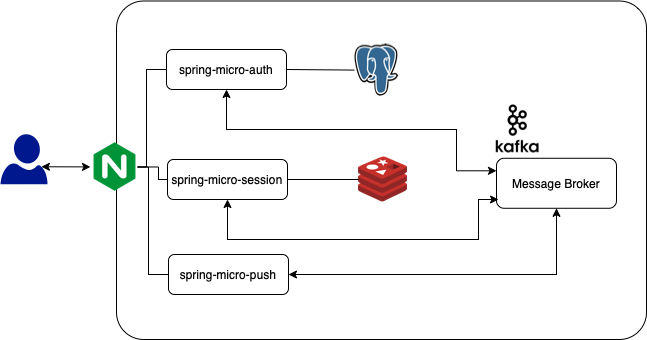
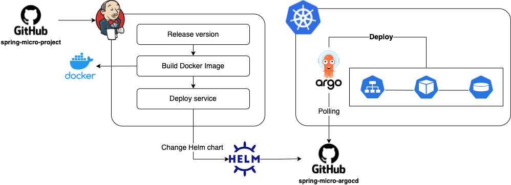

# spring-micro-argocd
This project is to set up ArgoCD repository for GitOps.
GitOps is a Continuous Delivery methodology centered around using Git as a single source of truth for declarative infrastructure and application code.
And ArgoCD is popular tool setting up GitOps in the kubernetes so I will migrate for all Helm charts for my microservice architecture services. 

Now, I'm setting up the server based on the microservice architecture using the Spring boot framework. This project is targeting to deploy into the kubernetes environment. 
For that, GitOps is suitable environment for this. 

## Microservice Architecture
This is my basic architecture of microsevice architecture and now this is evolving. This means that this architecture is changing. 

## Deployment
The deployment for this project is set up by Jenkins and Github Action. You can easily understand how these work. 

## ArgoCD Installation
You can see the basic installation step in this [link](./readme/argocd-installation.md).

## ArgoCD Login and Application Registration
You can see the basic installation step in this [link](./readme/argocd-login-register.md).

## Authors
- Allen Kim - Initial work - [coolexplorer](https://github.com/coolexplorer)

## License

This project is licensed under the MIT License - see the [LICENSE](./LICENSE) file for details